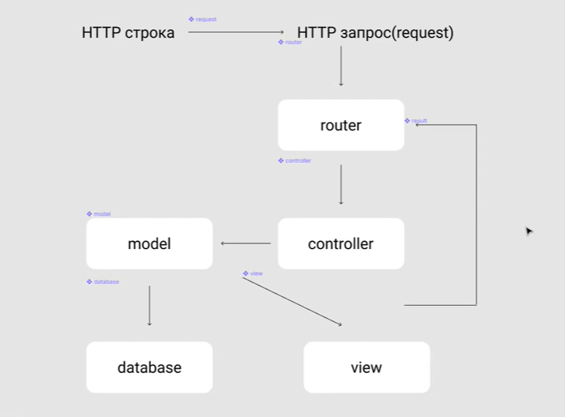

# MVC

1. Юзер формирует http запрос в строке
2. Запрос отправляется на сервер
3. Запрос передаётся маршрутизатору (`router`)
4. Роутер выбирает нужный контроллер (`controller`), который соответствует http строке
5. Контроллер дёргает модель (`model`), чтобы догрузить нужные данные
6. Модель делает всю работу с БД и подгружает данные для контроллера
    - по соглашению контроллер не имеет права лезть в БД
7. После того как данные загрузились в контроллер, он формирует ответ и посылает его в представление (`view`)

Между роутером и контроллером находится реквест, который валидирует входные данные
